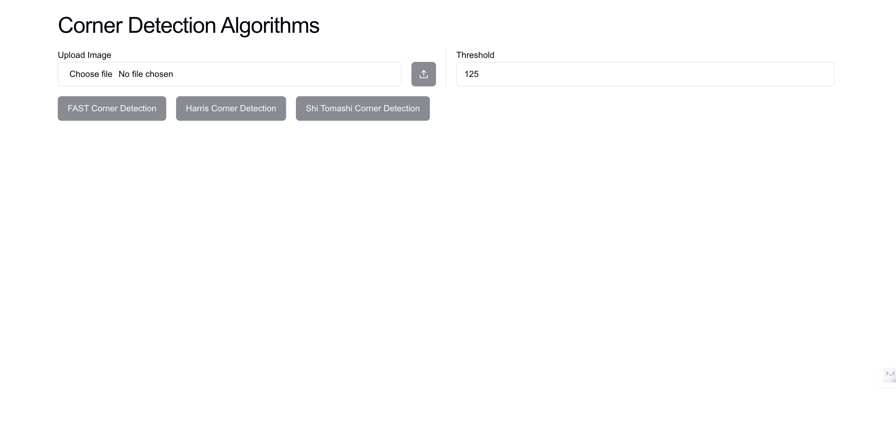

# Corner Detection Algorithms

Implementation of Shi-Tomashi, Harris, and FAST Corner Detection Algorithm in go, with frontend interface in next js. 

Report is submitted in this repository as well

## Prerequisites
Node js and Go should be installed on your desktop.

## To run the algorithms: 
- Frontend
    ```sh
    cd ui
    npm i
    npm run dev
    ```
- Backend
    ```sh
    cd backend
    go mod tidy
    go run .
    ```
> Now our app is live on http://localhost:3000

**You can see the detailed report [here](https://drive.google.com/file/d/1YMzZoSb637roswMuaOA3Z1cMQfTCDFUu/view?usp=drive_link)**
**You can see the detailed report [here](https://www.overleaf.com/read/gvfcxzzwcgwr#a3c8d5)**

## Project Screens

### NONE


### HARRIS


### FAST


### SHI TOMASHI

(The points in Shi Tomashi are less dense(visible on zooming)  )